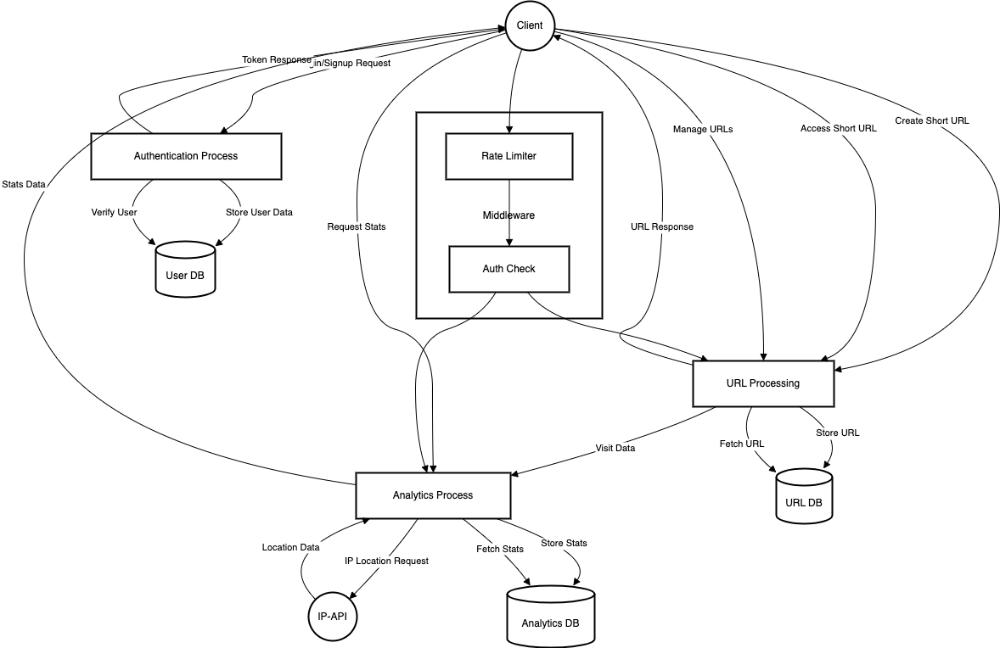

# URL Shortener Service

A simple URL shortener built with Node.js and TypeScript. This service allows users to shorten long URLs, track analytics, and manage their shortened URLs.

## Features

- **Unique Hash Generation**: Shorten URLs with a unique identifier.
- **URL Redirection**: Redirect from short URLs to original long URLs.
- **Click Tracking**: Track analytics like location, browser, and device.
- **Expiration Dates**: Set an expiration date for shortened URLs.
- **Manage URLs**: View and delete your shortened URLs.

## Use Cases

- Marketing campaigns to track engagement.
- Social media sharing of short links.
- Custom branded short URLs for promotions.

Here is the Data Flow Diagram (DFD) for the project:




## Installation

1. Clone the repository:
    ```bash
    git clone https://github.com/your-username/url-shortener.git
    cd url-shortener
    ```

2. Install dependencies:
    ```bash
    npm install
    ```

3. Set up environment variables:
    Create a `.env` file in the root directory of the project with the following content:
    ```
    MONGO_URI=mongodb://<your-username>:<your-password>@cluster0.mongodb.net/<your-db-name>?retryWrites=true&w=majority
    JWT_SECRET=<your-strong-jwt-secret-key>
    BASE_URL=http://localhost:3000
    PORT=3000
    ```
    - Replace `<your-username>`, `<your-password>`, and `<your-db-name>` with your MongoDB credentials.
    - Set `<your-strong-jwt-secret-key>` to a **strong, secure string** for JWT authentication.

4. Start the application:
    ```bash
    npm run dev
    ```

    The app will start on `http://localhost:3000`.

## API Endpoints

This API defines the following endpoints:

### Authentication

*   **`POST /api/user/signup`**: Registers a new user.
    *   Request Body:
        *   `email` (string, required): User's email address.
        *   `password` (string, required): User's password.
    *   Responses:
        *   `201 Created`: User successfully registered.
        *   `400 Bad Request`: User already exists or invalid input.
        *   `500 Internal Server Error`: Error creating user.

*   **`POST /api/user/login`**: Logs in a user.
    *   Request Body:
        *   `email` (string, required): User's email address.
        *   `password` (string, required): User's password.
    *   Responses:
        *   `200 OK`: Login successful, returns a JWT token.
        *   `400 Bad Request`: Invalid email or password.
        *   `500 Internal Server Error`: Error logging in.

### URL Management

*   **`GET /api/manage/urls`**: Gets all URLs owned by the authenticated user. Requires authentication.
    *   Responses:
        *   `200 OK`: Returns a list of URLs.
        *   `401 Unauthorized`: User needs to be authenticated.
        *   `404 Not Found`: No URLs found for this user.
        *   `500 Internal Server Error`: Error retrieving URLs.

*   **`DELETE /api/manage/:hash`**: Deletes a specific shortened URL by its hash. Requires authentication and ownership.
    *   Path Parameters:
        *   `hash` (string, required): The hash of the shortened URL to delete.
    *   Responses:
        *   `200 OK`: URL successfully deleted.
        *   `401 Unauthorized`: User needs to be authenticated.
        *   `404 Not Found`: URL not found or user does not have permission.
        *   `500 Internal Server Error`: Error deleting the URL.

### URL Shortening

*   **`POST /api/url/shorten`**: Shortens a URL. Requires authentication.
    *   Request Body:
        *   `originalUrl` (string, required): The URL to shorten.
        *   `expirationDate` (string, optional): ISO 8601 formatted expiration date.
    *   Responses:
        *   `200 OK`: Returns the shortened URL.
        *   `400 Bad Request`: Invalid or missing original URL.
        *   `401 Unauthorized`: Authentication required.
        *   `500 Internal Server Error`: Error shortening URL.

*   **`GET /api/url/:hash`**: Redirects to the original URL.
    *   Path Parameters:
        *   `hash` (string, required): The hash of the shortened URL.
    *   Responses:
        *   `301 Moved Permanently`: Redirects to the original URL.
        *   `404 Not Found`: URL not found.
        *   `410 Gone`: The URL has expired.
        *   `500 Internal Server Error`: Error processing the URL.

### URL Analytics

*   **`GET /api/url/analytics/:hash`**: Gets analytics for a shortened URL. Requires authentication and ownership.
    *   Path Parameters:
        *   `hash` (string, required): The hash of the shortened URL.
    *   Responses:
        *   `200 OK`: Returns analytics data (visit count, browser, device, location).
        *   `401 Unauthorized`: User needs to be authenticated.
        *   `403 Forbidden`: User is not the owner of the URL.
        *   `404 Not Found`: URL not found.
        *   `500 Internal Server Error`: Error retrieving analytics.

## Authentication

All routes under `/api/manage` and `/api/url/shorten`, `/api/url/analytics` are protected by JWT (JSON Web Token) authentication. You'll need to include a valid JWT in the `Authorization` header as a Bearer token.

## Rate Limiting

All routes are protected by rate limiting to prevent abuse.

## Validation

Input validation is performed on all relevant routes to ensure data integrity.

## Error Handling

The API returns appropriate HTTP status codes and error messages in case of errors.

## Example Usage

Example `POST /api/url/shorten` request:

```json
{
  "originalUrl": "[https://www.example.com](https://www.example.com)",
  "expirationDate": "2024-12-31T23:59:59Z"
}
